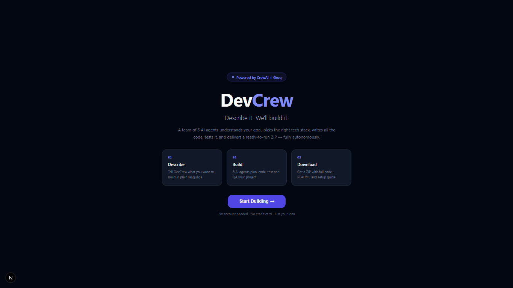
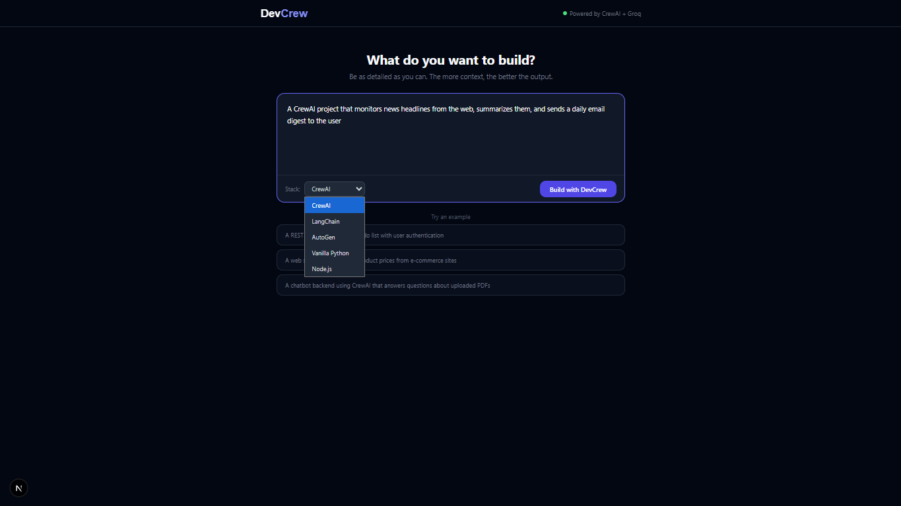
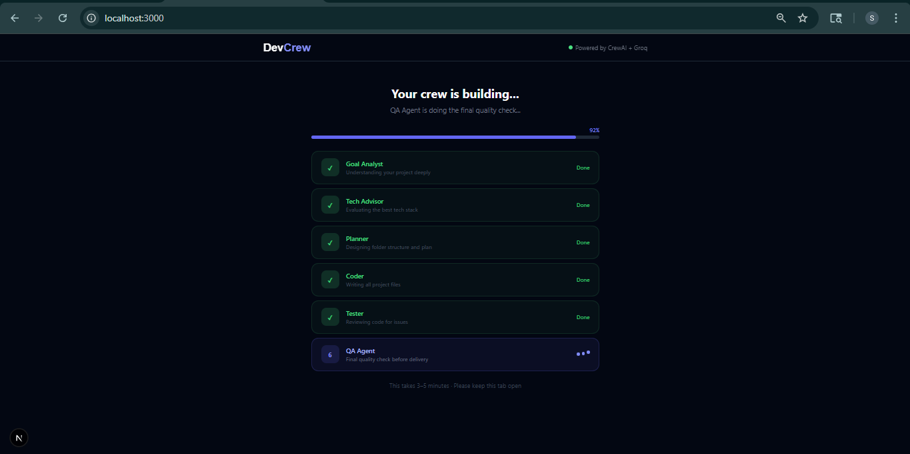
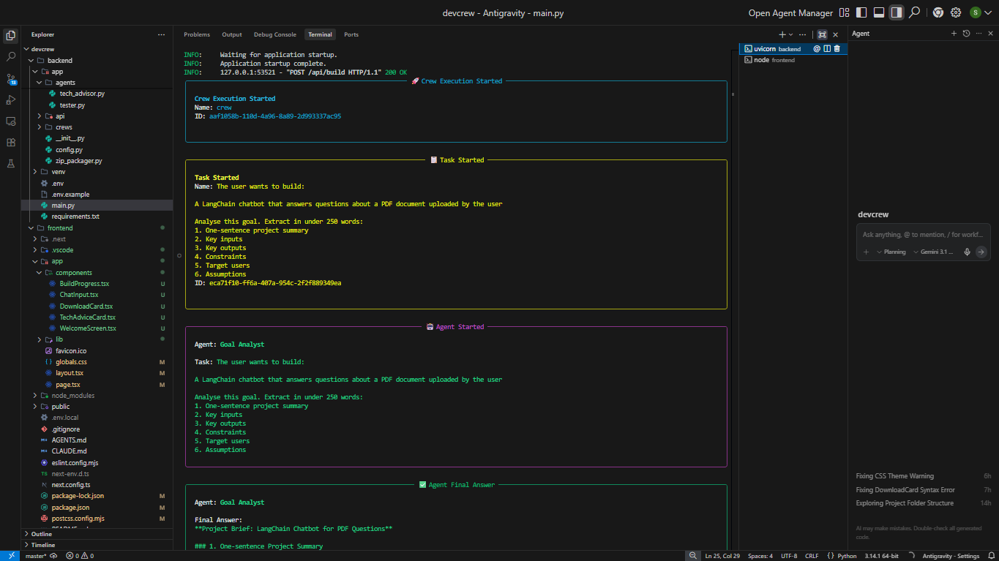
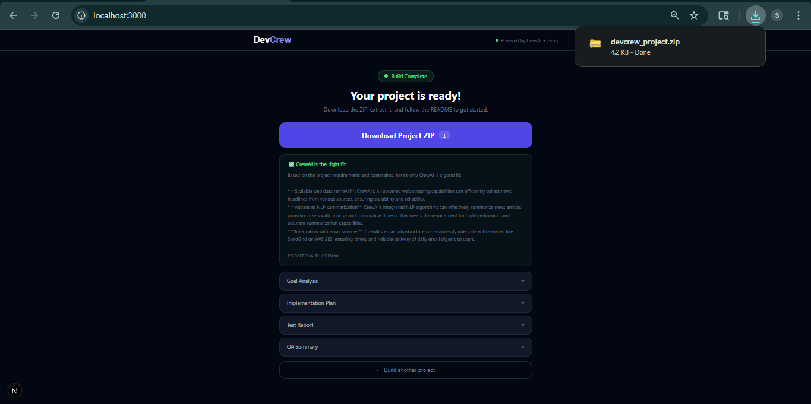
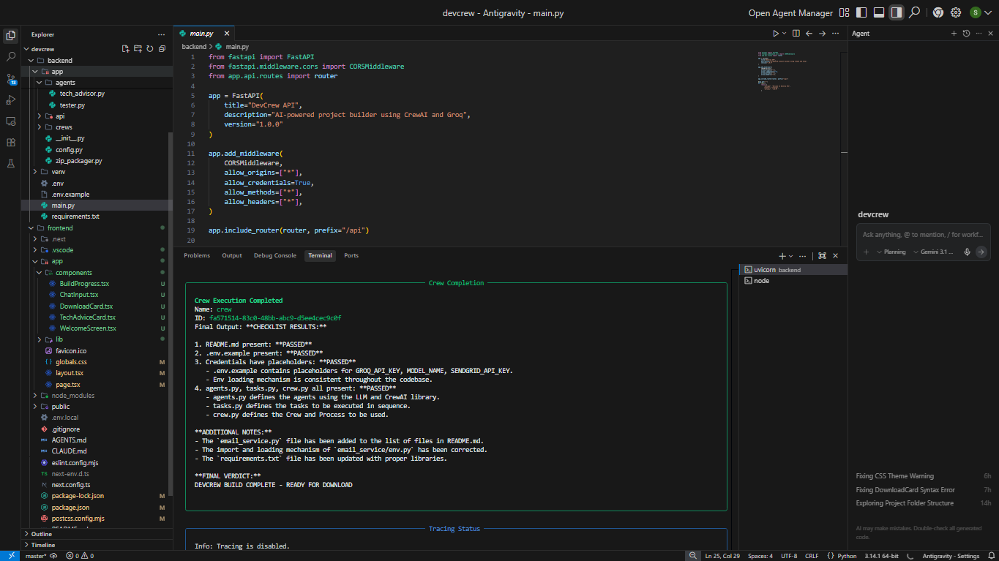
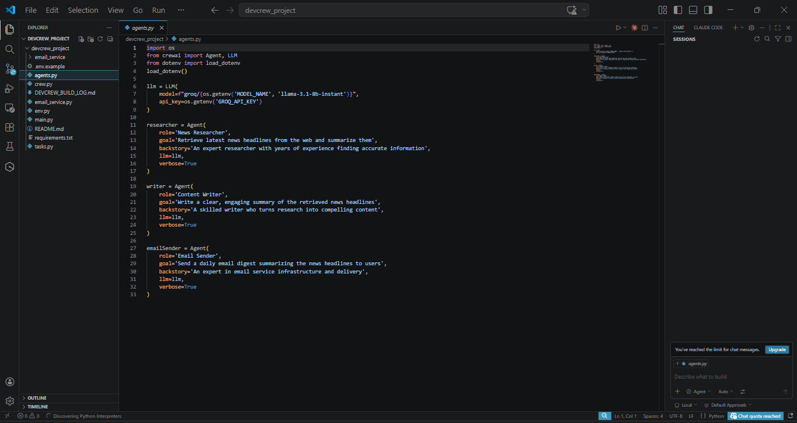
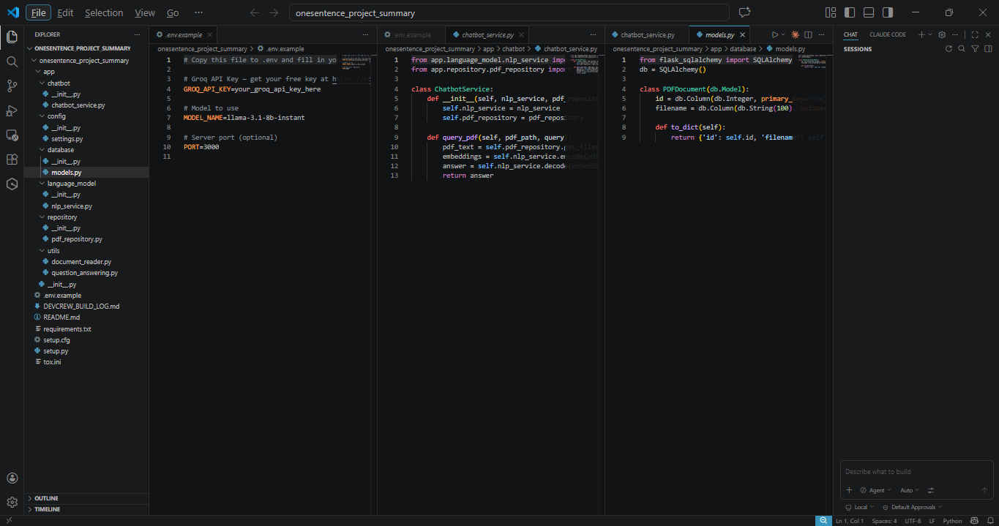

# DevCrew 🚀
### *Describe it. We'll build it.*

> **An AI-powered project builder that takes your idea, understands it deeply, recommends the right tech stack, writes all the code, tests it, and delivers a ready-to-run ZIP — fully autonomously.**

Built in one weekend. Became something real. Alhamdulillah.

---

## What is DevCrew?

DevCrew is a web application (think ChatGPT but for building projects) where you describe what you want to build in plain language, and a team of 6 AI agents collaborates to:

1. **Understand** your goal through deep analysis
2. **Recommend** the right tech stack — honestly, even if it means saying "don't use CrewAI for this"
3. **Plan** the complete folder structure and architecture
4. **Code** every single file from scratch
5. **Test** the code for broken imports, missing functions, and logic errors
6. **QA** the final output before packaging

Then it delivers a **downloadable ZIP file** with:
- All code files, fully written
- A README with setup instructions
- A `.env.example` with every credential placeholder explained
- A build log

No account needed. No credit card. Just your idea.

---

## Screenshots

<div align="center">

### Welcome & Input
<table>
  <tr>
    <td align="center" width="50%">
      
      <br/>
      <sub><b>🏠 Welcome Screen</b></sub>
      <br/>
      <sub>Clean landing page — no account, no friction</sub>
    </td>
    <td align="center" width="50%">
      
      <br/>
      <sub><b>💬 Goal Input</b></sub>
      <br/>
      <sub>Describe your project in plain language</sub>
    </td>
  </tr>
</table>

### Build in Action
<table>
  <tr>
    <td align="center" width="50%">
      
      <br/>
      <sub><b>⚙️ Live Build Progress</b></sub>
      <br/>
      <sub>6 agents working — Goal Analyst → Tech Advisor → Planner → Coder → Tester → QA</sub>
    </td>
    <td align="center" width="50%">
      
      <br/>
      <sub><b>🖥️ Terminal — Agents Running Live</b></sub>
      <br/>
      <sub>Real CrewAI agent logs streaming in the backend</sub>
    </td>
  </tr>
</table>

### Output & Delivery
<table>
  <tr>
    <td align="center" width="50%">
      
      <br/>
      <sub><b>✅ Build Complete</b></sub>
      <br/>
      <sub>ZIP ready — goal analysis, plan, test report all visible</sub>
    </td>
    <td align="center" width="50%">
      
      <br/>
      <sub><b>🏁 DEVCREW BUILD COMPLETE</b></sub>
      <br/>
      <sub>All 6 agents confirmed delivery in terminal</sub>
    </td>
  </tr>
</table>

### Generated Code Quality
<table>
  <tr>
    <td align="center" width="50%">
      
      <br/>
      <sub><b>🤖 Generated CrewAI Project</b></sub>
      <br/>
      <sub>agents.py, tasks.py, crew.py — real working CrewAI code</sub>
    </td>
    <td align="center" width="50%">
      
      <br/>
      <sub><b>🦜 Generated LangChain Project</b></sub>
      <br/>
      <sub>Full project structure with services, models, routes</sub>
    </td>
  </tr>
</table>

</div>

---

## The Stack

| Layer | Technology |
|-------|-----------|
| Frontend | Next.js 16 + Pure CSS |
| Backend | FastAPI (Python) |
| AI Orchestration | CrewAI |
| LLM Provider | Groq (free tier) |
| Model | `llama-3.1-8b-instant` |
| Output | ZIP file download |
| Hosting | Vercel (frontend) + Render (backend) |
| Cost | ₹0 |

---

## The 6 Agents Inside DevCrew

DevCrew itself runs on CrewAI. These are the agents working every time you submit a project:

```
Goal Analyst      → Understands what you actually want to build
Tech Advisor      → Recommends CrewAI or alternatives honestly
Planner           → Designs the complete folder structure
Coder             → Writes every file from scratch
Tester            → Reviews code for broken imports and bugs
QA Agent          → Final delivery check before ZIP packaging
```

Each agent runs sequentially with a 25 second pause between them to respect Groq's free tier rate limits. The whole build takes 3–5 minutes.

---

## Why We Built This

This started as a weekend fun project — "what if CrewAI could build projects using CrewAI itself?"

The idea was simple:
- Most AI coding tools (Cursor, Copilot, Devin) assist developers
- DevCrew targets **anyone with an idea** — developer or not
- You describe it in plain English, DevCrew delivers a ZIP

What made it interesting was the **Tech Advisor agent** — it honestly tells you if CrewAI is overkill for your goal. In our own testing, when we asked it to build "a simple Python CSV reader," it said:

> *"CrewAI is overkill for this. Use Pandas."*

That's the kind of honesty we wanted to build in from day one.

---

## The Honest Story — How We Got Here

This wasn't a straight line. Here's what actually happened, step by step.

### Phase 1 — The Idea (5 minutes)

Started with a conversation about what kind of product to build. The options were:

- A VS Code extension (like Cursor/Antigravity)
- A standalone desktop app
- A web app (like ChatGPT)

**Decision:** Web app. Fastest path to something shareable. Cursor/Antigravity-style apps need full engineering teams and years of work. A web app with a chat interface maps perfectly to the "describe it → build it" flow.

### Phase 2 — Backend First (1–2 hours)

Built the FastAPI backend with CrewAI. The structure:

```
backend/
├── app/
│   ├── agents/          ← 6 agent files
│   ├── crews/           ← build_crew.py (the pipeline)
│   ├── api/             ← FastAPI routes
│   ├── config.py
│   └── zip_packager.py
├── main.py
├── .env
└── requirements.txt
```

First error we hit — **CrewAI LLM compatibility**:

```
2 validation errors for Agent
llm.str — Input should be a valid string
llm.BaseLLM — Input should be a valid dictionary or instance of BaseLLM
```

The fix: switched from `langchain_groq.ChatGroq` to CrewAI's native `LLM` class:

```python
# WRONG
from langchain_groq import ChatGroq
llm = ChatGroq(api_key=..., model=...)

# RIGHT
from crewai import Agent, LLM
llm = LLM(model="groq/llama-3.1-8b-instant", api_key=...)
```

Then hit the **LiteLLM error** — Groq wasn't a native provider in CrewAI 1.13.0:

```
Unable to initialize LLM with model 'groq/llama-3.1-8b-instant'.
LiteLLM fallback package is not installed.
```

Fix: `pip install litellm`. One line. Problem solved.

### Phase 3 — The Rate Limit Battle (ongoing)

Groq's free tier: **6,000–12,000 tokens per minute**. Six agents generating thousands of tokens each = constant rate limit errors.

```
RateLimitError: Limit 12000, Used 11127, Requested 4909.
Please try again in 20.18s.
```

Three attempts to solve this:

**Attempt 1** — Switch models. Tried `llama3-8b-8192` → deprecated. Tried `llama-3.1-8b-instant` → lower TPM limit (6000). Made it worse.

**Attempt 2** — Run all agents in one crew. Still hitting limits because context kept accumulating.

**Attempt 3 (final fix)** — Run each agent as its own separate crew with 25 second delays between them:

```python
for i, task in enumerate(all_tasks):
    crew = Crew(agents=[...], tasks=[task], process=Process.sequential)
    result = crew.kickoff()
    time.sleep(25)  # breathe between agents
```

This worked. Build takes 3–5 minutes now instead of 30 seconds, but it completes reliably.

### Phase 4 — The Frontend Tailwind Nightmare

Next.js 16 changed how Tailwind CSS works completely. Previous versions used `tailwind.config.js` + `@tailwind base/components/utilities`. Version 16 uses Tailwind v4 with `@import "tailwindcss"` and a new PostCSS setup.

The result: **three failed attempts** and one Node.js memory crash that took 15+ minutes before killing itself:

```
<--- Last few GCs --->
[42848:0000024BF4A04000] Scavenge 8.1 (11.0) -> 6.7 MB, 1.96ms allocation failure
```

**Final solution:** Dropped Tailwind completely. Wrote pure CSS with custom classes. Zero framework dependencies. Works on every Next.js version. Lesson learned.

### Phase 5 — The Code Quality Journey

This is the most honest part of the story.

**First build output** — the generated code used CrewAI even when the user picked LangChain. The Coder agent's backstory was so focused on CrewAI patterns that it bled into everything.

**Second build output** — LangChain project generated with wrong import paths:

```javascript
// Generated (WRONG)
import PyPDFLoader from 'langchain/pdf_loader'  // Python class in JS
import FAISS from 'langchain/vector-store'       // wrong path

// Correct
const { PDFLoader } = require('@langchain/community/document_loaders/fs/pdf')
const { MemoryVectorStore } = require('langchain/vectorstores/memory')
```

Also mixed `require()` and `import` in the same files — immediate crash on Node.js.

**The fix** — gave each stack its own reference pattern inside the Coder agent's backstory. Not just instructions — actual working example code for CrewAI, LangChain, Vanilla Python, and Node.js. The agent now has a template to follow, not just rules.

**Third build output** — CrewAI projects generating perfect code:

```python
# agents.py — exactly correct
from crewai import Agent, LLM
llm = LLM(model=f"groq/{os.getenv('MODEL_NAME')}", api_key=os.getenv('GROQ_API_KEY'))

researcher = Agent(
    role='Senior Researcher',
    goal='Research the given topic thoroughly',
    backstory='An expert researcher...',
    llm=llm,
    verbose=True
)
```

No subclassing. No string agent references. No wrong imports. The pattern worked.

**Current state:**
- CrewAI projects: ~95% quality ✅
- LangChain Python: ~85% quality ✅
- LangChain Node.js: ~70% quality (work in progress)
- Vanilla Python: ~80% quality ✅

---

## What Works Right Now

```
✅ Full 6-agent pipeline running end to end
✅ CrewAI projects generated with correct patterns
✅ LangChain projects generated (Python and Node.js)
✅ ZIP download working in browser
✅ Tech Advisor honestly recommends alternatives
✅ .env.example with proper credentials per stack
✅ Rate limit retries (5 attempts, increasing delay)
✅ Progress tracking UI
✅ Clean web interface
✅ Zero hosting cost (Vercel + Render free tiers)
```

## What's Still Being Improved

```
🔄 LangChain Node.js import paths need refinement
🔄 AutoGen stack support (coming)
🔄 Voice/audio input for goal description
🔄 Q&A clarification flow before building
🔄 Per-agent real-time progress streaming
🔄 Public deployment (backend + frontend)
```

---

## Running It Locally

### Prerequisites
- Python 3.11+
- Node.js 18+
- Git
- A free Groq API key from [console.groq.com](https://console.groq.com)

### Backend Setup

```bash
cd backend
python -m venv venv
venv\Scripts\activate        # Windows
# source venv/bin/activate   # Mac/Linux

pip install -r requirements.txt
pip install litellm
```

Create `backend/.env`:
```env
GROQ_API_KEY=your_groq_api_key_here
MODEL_NAME=llama-3.1-8b-instant
APP_ENV=development
```

Start backend:
```bash
uvicorn main:app --reload
```

Backend runs at `http://127.0.0.1:8000`

### Frontend Setup

```bash
cd frontend
npm install
```

Create `frontend/.env.local`:
```env
NEXT_PUBLIC_API_URL=http://127.0.0.1:8000
```

Start frontend:
```bash
npm run dev
```

Frontend runs at `http://localhost:3000`

---

## Project Structure

```
devcrew/
├── backend/
│   ├── app/
│   │   ├── agents/
│   │   │   ├── goal_analyst.py
│   │   │   ├── tech_advisor.py
│   │   │   ├── planner.py
│   │   │   ├── coder.py
│   │   │   ├── tester.py
│   │   │   └── qa.py
│   │   ├── crews/
│   │   │   └── build_crew.py
│   │   ├── api/
│   │   │   └── routes.py
│   │   ├── config.py
│   │   └── zip_packager.py
│   ├── main.py
│   ├── .env
│   └── requirements.txt
└── frontend/
    ├── app/
    │   ├── components/
    │   │   ├── WelcomeScreen.tsx
    │   │   ├── ChatInput.tsx
    │   │   ├── BuildProgress.tsx
    │   │   ├── TechAdviceCard.tsx
    │   │   └── DownloadCard.tsx
    │   ├── lib/
    │   │   └── api.ts
    │   ├── globals.css
    │   ├── layout.tsx
    │   └── page.tsx
    └── .env.local
```

---

## Key Technical Decisions

### Why CrewAI over LangGraph or AutoGen?
CrewAI's sequential process maps perfectly to a build pipeline. Goal → Plan → Code → Test → QA is literally what CrewAI was designed for. LangGraph would give more control but requires more boilerplate. AutoGen is better for conversational agents. CrewAI won.

### Why Groq over OpenAI?
Free tier. Zero cost to start. Fast inference. `llama-3.1-8b-instant` is surprisingly capable for code generation tasks. The rate limits are the only tradeoff.

### Why not a VS Code extension?
A web app reaches everyone — developers and non-developers. A VS Code extension only reaches developers already in an IDE. The chat interface also maps perfectly to the "describe it" input model.

### Why pure CSS over Tailwind?
Next.js 16 + Tailwind v4 + Turbopack = memory crashes. After three failed attempts and one 15-minute Node.js OOM crash, pure CSS was faster, more predictable, and works everywhere.

---

## Lessons Learned

**1. Rate limits will humble you.** 6000 TPM sounds like a lot until 6 agents each output 2000 tokens. Add delays. Retry gracefully. Don't fight the API.

**2. LLM agents need examples, not just instructions.** Telling the Coder agent "use CrewAI patterns" didn't work. Giving it a working reference template it could literally follow did.

**3. Ship the web app first.** The instinct was to build a VS Code extension or desktop app. The web app was the right call — faster to build, easier to share, no install friction.

**4. Honesty in AI is a feature.** The Tech Advisor agent recommending against CrewAI for simple tasks wasn't a bug — it was the most valuable part of the product. Users trust it more because of it.

**5. Start with the backend.** Every hour spent on a working backend made the frontend trivial. Every hour spent on UI without a working backend was wasted.

---

## What This Project Means

Started as: *"what if we made a fun weekend project with CrewAI?"*

Became: A full-stack AI application with a 6-agent pipeline, real rate limit handling, stack-specific code generation, ZIP packaging, and a working web interface.

The journey from "let's build something" to "Alhamdulillah this actually works" involved:
- 14+ backend files written from scratch
- 6 agent definitions refined through real failures
- 3 Tailwind approaches before abandoning it entirely
- 5+ model switches finding the right Groq model
- Hundreds of rate limit retries
- Real generated projects opening in VS Code with actual working code

This is what building looks like. Not a straight line. A series of failures that slowly became a product.

---

## Built By

**Developer:** Shaik Asad Ahmed
**AI Pair:** Claude (Anthropic) used for architecture, code, debugging, and this README

> *"This was a weekend fun project but became a huge milestone Alhamdulillah"*
> — The developer, at 1am after seeing the first ZIP download work

---

## License

MIT — build whatever you want with this.

---

*Generated by humans who refused to give up, powered by AI that refused to hallucinate (mostly).*

**Bismillah. We built it.** 🚀
